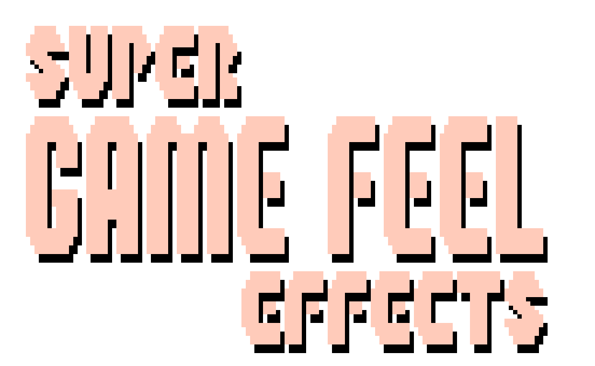
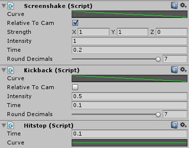

<pre>
<head>
	<title>Super Game Feel Effects Documentation</title>
	<link rel="shortcut icon" type="image/png" href="/SGFEDocImages/favicon.png"/>
</head>
</pre>
 
 
 
<article class="column"><article class="banner">
 
 
Super Game Feel Effects Documentation - v1.0
</article><article class="tableofcontents"><article class="textarea">
#Table of Contents

[Features](#Features)

1. [Adding Super Game Feel Effects to Unity](#Adding Super Game Feel Effects to Unity)
	* [Importing Super Game Feel Effects into Unity](#Importing Super Game Feel Effects into Unity)
	* [Adding Super Game Feel Effects to a Scene](#Adding Super Game Feel Effects to a Scene)
2. [Getting Started](#Getting Started)
	* [Tips & Tricks](#Tips & Tricks)
3. [Functions & Variables](#Functions & Variables)
	* [Screenshake](#Screenshake)
	* [Kickback](#Kickback)
	* [Hitstop](#Hitstop)

[Notes](#Notes)
[ChangeLog](#ChangeLog)
[Credits](#Credits)
</article></article><article class="textarea">

***

#Features
* Super Game Feel Effects is a Unity tool that allows you to add game feel effects like Screenshake, Kickback, and Hitstop to a game without conflict.
* All effects work with other scripts. Screenshake and Kickback do not interfere with any other camera scripts.
* Extentions allow all functions to be called through a camera.

***

#1. Adding Super Game Feel Effects to Unity

##a. Importing Super Game Feel Effects into Unity 

To import Super Game Feel Effects into your project, either drag in the .unitypackage file, or get it from the asset store window.

###Imported folders, what they do, and if you need to import them or not, alphabetically:

* __"Documentation"__ contains these docs! You don't need to import them, but you probably should!
* __"Example"__ contains the demo scene. Not needed if you don't want the demo.

"ConstantShake.cs" is a bonus script for making an object shake constantly.
"SuperGameFeelEffectsExtentions.cs" allows the rest of the scripts to be called as a camera extention.
The rest of the scripts are the actual Screenshake, Kickback, and Hitstop effects.

##b. Adding Super Game Feel Effects to a Scene

To add any Super Game Feel Effects script to a camera, select "Add Component" in the inspector of an existing camera. They can be found under "Utility > Super Game Feel Effects".

***

#2. Getting Started

##a. Tips & Tricks

* Screenshake, Kickback, and Hitstop can all be called through the camera they're attached to! So instead of calling "Camera.main.GetComponent<Screenshake>().Shake()", you can just call "Camera.main.Shake()".

* If you want to 'store' multiple types of screenshakes on the same camera, you can call specific scripts directly.

<article class="rightbox">
  
The inspector window.
</article>

***

#3. Functions & Variables

##a. Screenshake

* ###void Screenshake.Shake()

* ###void Camera.Shake()
	Tells the camera to shake, with the current preferences.

* ###void Screenshake.Shake(float multiplier)

* ###void Camera.Shake(float multiplier)
	Tells the camera to shake, with the current preferences, with a multiplier on the intensity.

* ###AnimationCurve Screenshake.curve
	The intensity of the screenshake over time.

* ###Vector3 Screenshake.strength
	The strength of the screenshake effect based on the curve, split into axises.

* ###bool Screenshake.useLocalSpace
	Whether or not Screenshake.strength is relative to the direction the camera is facing, or world rotation. This will most likely want to be set to true.

* ###float Screenshake.intensity
	A multipier of strength.

* ###float Screenshake.time
	How long the shake effect lasts.

* ###[RANGE 0 - 7] int Screenshake.roundDecimals
	Whether or not the screenshake effect will be rounded to a specific decimal place or not. Not rounded if left at 7.

##b. Kickback

* ###void Kickback.Kick(Vector3 normalizedDirection)

* ###void Camera.Kick(Vector3 normalizedDirection)
	Tells the camera to kickback with a specified vector, multiplied by strength.

* ###void Kickback.Kick(Vector3 normalizedDirection, float multiplier)

* ###void Camera.Kick(Vector3 normalizedDirection, float multiplier)
	Tells the camera to shake, with the current preferences, with a multiplier on the intensity.

* ###AnimationCurve Kickback.curve
	The intensity of the kickback over time.

* ###bool Kickback.useLocalSpace
	Whether or not the kickback's normalizedDirection is relative to the direction the camera is facing, or not.

* ###float Kickback.intensity
	How much the camera will kick back.

* ###float Kickback.time
	How long the kickback lasts.

* ###[RANGE 0 - 7] int Kickback.roundDecimals
	Whether or not the kickback will be rounded to a specific decimal place or not. Not rounded if left at 7.

##c. Hitstop

* ###void Hitstop.Stop()

* ###void Camera.Stop()
	Sets the game's timescale to follow the curve for the specified amount of time.

* ###void Hitstop.Stop(float multiplier)

* ###void Camera.Stop(float multiplier)
	Sets the game's timescale to follow the curve for the specified amount of time, with time multipied by the multiplier.

* ###float Hitstop.time
	The amount of time the effect will last for.

* ###AnimationCurve Hitstop.curve
	The value the effect will be, over time. By default this is a horizontal line at a 0 value.

***

#Notes
* If a function is called through a camera, and the camera does not yet have the component, it will automatically be added to the camera and called. The default strength/intensity for each component is set to 1, so the multiplier can be useful when using this method.
* "ConstantShake.cs" is a bonus script that can be attached to an object.

##Known Bugs
* None at the moment!

##Planned Features / To Do List:
* Nothing at the moment!

***

#ChangeLog
###v1.0
* Initial release!

***

#Credits
Coding and design by Kai Clavier ([@KaiClavier](http://twitter.com/KaiClavier))  
Extra CSS help by Tak ([@takorii](http://twitter.com/takorii))  
 
 
</article>
</article>